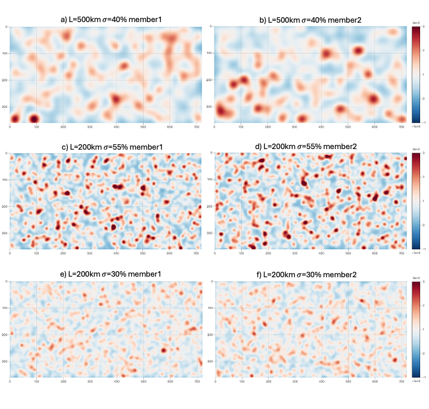
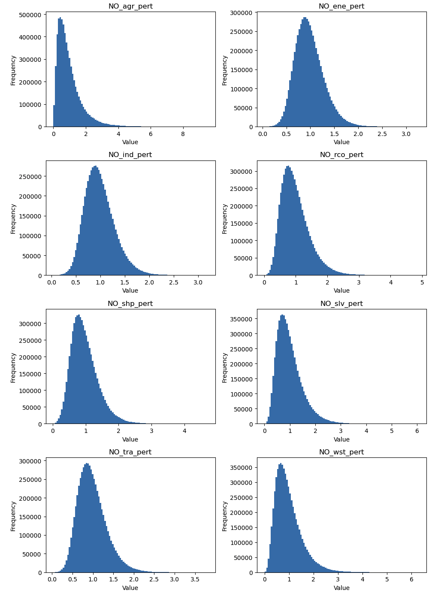

# Perturbator - Emission Perturbation Generator

[](https://doi.org/10.5281/zenodo.18969196)
[](https://opensource.org/licenses/Apache-2.0)

A Python tool for generating spatially-correlated random perturbations for emission fields, designed for ensemble data assimilation applications.

## Overview

The **Perturbator** tool (`gamma_pert.py`) creates smooth, spatially-correlated random perturbation fields using gamma distributions and Gaussian kernel smoothing. This is particularly useful for:

- Perturbing emission inventories (e.g., CEDS - Community Emissions Data System or any inventory on lat-lon grids)
- Generating ensemble members for emission uncertainty impact quantification
- Creating scaling factors for atmospheric chemistry models

### Why Gamma Over Gaussian or Lognormal?

1. **Always positive**: Unlike Gaussian, gamma-scaled never produces negative scaling factors, but unlike log normal doesn't produces overly tailed distributions for low errors/spread distributions.
2. **Flexible shape**: Single parameterization smoothly transitions between Gaussian-like and lognormal-like
3. **Simple mean control**: Easy to ensure mean = 1 for unbiased perturbations

## Features

- **Gamma-distributed perturbations**: Uses gamma distributions that transition from Gaussian-like (low errors) to lognormal-like (high errors) shapes
- **Spatial correlation**: Applies Gaussian kernel smoothing to create horizontally correlated perturbation fields
- **Multi-sector support**: Apply different perturbation magnitudes and correlation lengths to different emission sectors
- **Multi-species support**: Process multiple chemical species simultaneously
- **Ensemble generation**: Generate multiple ensemble members in a single run
- **NetCDF I/O**: Read and write standard NetCDF emission files with compression support

## Installation

### Dependencies

```bash
pip install numpy scipy xarray pyyaml netCDF4
```

### Required Python packages:
- `numpy` - Numerical operations
- `scipy` - Signal processing and interpolation
- `xarray` - NetCDF file handling
- `pyyaml` - YAML configuration parsing
- `netCDF4` - netcdf library

## Usage

### Basic Command

```bash
python gamma_pert.py -i input.yaml
```

### Command Line Arguments

| Argument | Description |
|----------|-------------|
| `-i`, `--yaml_file` | **Required.** Path to the YAML configuration file |

### Quick Test

A reduced-resolution test case is included in the repository and can be run immediately:

```bash
python gamma_pert.py -i input.yaml
```

This uses `NOx_anthro_CEDS_2019_reduced.nc` (a 360×180 global grid) and generates 3 ensemble members. Output files `NOx_anthro_CEDS_2019_reduced_pert001.nc`, `_pert002.nc`, `_pert003.nc` will be written to the current directory.

Two additional YAML files are provided as **reference configurations** for production use on full-resolution CEDS grids but require access to the corresponding input files:
- `input_CEDS_NO.yaml` — monthly 3600×1800 CEDS emissions for NO, CO, CH2O (32 members)
- `input_CEDS_NO_hourly.yaml` — hourly 720×360 CEDS emissions for NO, CO, CH2O (32 members)

## Configuration

The tool is configured via a YAML input file. Below are the configuration parameters:

### YAML Configuration Parameters

| Parameter | Type | Description |
|-----------|------|-------------|
| `template file` | string | NetCDF file used as a template for grid dimensions |
| `emission files` | list | List of emission NetCDF files to perturb |
| `species list` | list | List of chemical species prefixes (e.g., `['NO', 'CO', 'CH2O']`) |
| `sector list` | list | List of emission sector suffixes (e.g., `['_agr', '_ene', '_ind']`) |
| `sector pert` | list | Relative perturbation magnitude for each sector (standard deviation) |
| `sector hcor` | list | Horizontal correlation length for each sector (in km) |
| `geo dims` | list | Names of longitude and latitude dimensions `[lon_dim, lat_dim]` |
| `time dim` | string | Name of the time dimension |
| `members` | int | Number of ensemble members to generate |
| `scaling factors out` | bool | If `True`, output scaling factor fields as separate variables |
| `only scaling` | bool | If `True`, only output scaling factors (drop original perturbed fields) |
| `inpath` | string | Input directory path |
| `outpath` | string | Output directory path |
| `domain` | string | Domain type (currently only `"global"` is supported) |

### Example YAML Configuration

```yaml
template file: NO_anthro_CEDS_x3600_y1800_t12.2019.nc
emission files: [NO_anthro_CEDS_x3600_y1800_t12.2019.nc, CO_anthro_CEDS_x3600_y1800_t12.2019.nc]
species list: ['NO', 'CO']
sector list: [_agr, _ene, _ind, _rco, _shp, _slv, _tra, _wst]
sector pert: [0.75, 0.3, 0.3, 0.45, 0.40, 0.5, 0.35, 0.55]  # relative error (not %)
sector hcor: [500, 500, 500, 500, 1000, 500, 500, 500]       # correlation length in km
geo dims: [lon, lat]
time dim: time
members: 32
scaling factors out: True
only scaling: True
inpath: /path/to/input/
outpath: /path/to/output/
domain: global
```

## Algorithm Details

The algorithm generates spatially-correlated perturbation fields in two main steps:

### Step 1: Random Field Generation

The `gamma_scaled` function samples from a gamma distribution parameterized to have **mean = 1** and **standard deviation = σ** (the specified error). The `BuildRandomSample` function creates a 2D random field at reduced resolution (proportional to the correlation length) and upsamples it to the full grid using bilinear interpolation.

### Step 2: Spatial Smoothing

The `Kernel` and `Smooth` functions apply a normalized 2D Gaussian convolution (via FFT) that:
- Introduces spatial correlation with the specified length scale
- **Preserves the mean** (kernel sums to 1)
- **Preserves the standard deviation** (through proper kernel normalization)

The `BuildMemberPert` function combines both steps to produce the final perturbation field for each ensemble member and time step.

## Output Files

Output files follow the naming convention:
```
{base_name}_pert{XXX}.nc
```
Where `XXX` is the zero-padded ensemble member number (001, 002, etc.).

### Output Variables

For each emission variable `{species}{sector}`:
- **Perturbed emissions**: `{species}{sector}` (if `only scaling: False`)
- **Scaling factors**: `{species}{sector}_pert` (if `scaling factors out: True`)

### Compression

Output NetCDF files are compressed with:
- **zlib compression** (complevel=5)
- **Shuffle filter** enabled
- **Chunking** optimized for typical access patterns

## Mathematical Background

### Gamma Distribution Formulation

The gamma distribution is a two-parameter family of continuous probability distributions. The probability density function (PDF) is:

$$f(x; \alpha, \theta) = \frac{x^{\alpha-1} e^{-x/\theta}}{\theta^\alpha \Gamma(\alpha)}, \quad x > 0$$

Where:
- $\alpha > 0$ is the **shape parameter**
- $\theta > 0$ is the **scale parameter**
- $\Gamma(\alpha)$ is the gamma function

### Parameterization for Unit Mean

For emission perturbations, we require scaling factors with **mean = 1** and a specified **relative error** (standard deviation) $\sigma$. The gamma distribution moments are:

$$\mathbb{E}[X] = \alpha \theta$$
$$\text{Var}(X) = \alpha \theta^2$$

To achieve mean = 1 with standard deviation = $\sigma$, we solve:

$$\alpha \theta = 1 \quad \text{(mean constraint)}$$
$$\alpha \theta^2 = \sigma^2 \quad \text{(variance constraint)}$$

which gives:

$$\alpha = \frac{1}{\sigma^2}, \quad \theta = \sigma^2$$

With the derived parameters, the mean is:

$$\mathbb{E}[X] = \alpha \theta = \frac{1}{\sigma^2} \cdot \sigma^2 = 1$$

And the variance is:

$$\text{Var}(X) = \alpha \theta^2 = \frac{1}{\sigma^2} \cdot \sigma^4 = \sigma^2$$

This ensures that:
1. The **average perturbation factor is 1** (no systematic bias in emissions)
2. The **spread is controlled by the specified error** $\sigma$

For **small errors** ($\sigma < 0.3$), the shape parameter $\alpha = 1/\sigma^2$ becomes large converges to a Gaussian distribution.

For **large errors** ($\sigma > 1.0$), the shape parameter $\alpha = 1/\sigma^2$ becomes small exhibits heavy right-skewness, similar to a lognormal distribution.

Both gamma and lognormal share key properties in this regime:
- **Strictly positive** values (essential for emission scaling)
- **Heavy right tail** (allows large positive perturbations)
- **Mode < Mean < Median** ordering

| Error Regime | $\sigma$ | Skewness | Distribution Shape |
|--------------|----------|----------|-------------------|
| Low | < 0.3 | < 0.6 | ≈ Gaussian (symmetric) |
| Medium | 0.3 - 1.0 | 0.6 - 2.0 | Intermediate |
| High | > 1.0 | > 2.0 | ≈ Lognormal (right-skewed) |

### Spatial Correlation

#### Correlation Length Scale Definition

The horizontal correlation length is specified in **kilometers** in the YAML configuration (`sector hcor`). The code converts this to grid points using the equatorial Earth circumference:

$$\sigma_{\text{grid}} = \frac{L_h}{R_{\text{eq}}}$$

#### Gaussian Kernel Formulation

The Gaussian smoothing kernel in 2D is:

$$K(x, y) = \frac{1}{2\pi\sigma^2} \exp\left(-\frac{x^2 + y^2}{2\sigma^2}\right)$$

The kernel is normalized ($\sum K = 1$) to preserve the mean of the perturbation field during convolution.

#### Polar Singularity Limitation

A kernel with fixed grid-point width represents a much smaller physical distance near the poles. A 500 km correlation at the equator becomes effectively ~250 km at 60°N/S and ~85 km at 80°N/S.

For applications requiring strictly **uniform, isotropic spatial correlations** on the sphere, the **JEDI (Joint Effort for Data assimilation Integration)** framework, for example, provides more sophisticated tools.

These tools could properly account for the spherical geometry and maintain isotropic correlation lengths regardless of latitude. However, they require:
- Full JEDI software stack installation
- Model interface implementation (e.g., FV3, MPAS, etc.)
- More setup complexity

For many practical applications, especially in the tropics and mid-latitudes where most emissions occur, the simplified lat-lon approach in this tool provides adequate results with minimal setup overhead.


## Example: Multi-Species CEDS Emissions

See `input_CEDS_NO.yaml` and `input_CEDS_NO_hourly.yaml` for complete examples with multiple species and CEDS sectors.

### Example Perturbation Fields



**Figure 1.** Example perturbation fields showing the effect of correlation length and perturbation magnitude on spatial structure. 
- **Top row (a, b)**: L=500km, σ=40% — Large correlation length produces broad, smooth perturbation patterns
- **Middle row (c, d)**: L=200km, σ=55% — Shorter correlation length with higher uncertainty creates finer-scale structure
- **Bottom row (e, f)**: L=200km, σ=30% — Same correlation length but lower uncertainty reduces the amplitude of perturbations

Each column shows a different ensemble member, demonstrating the random variability between members while maintaining consistent spatial correlation structure. Values represent multiplicative scaling factors centered around 1 (blue < 1, white ≈ 1, red > 1).

### Perturbation Value Distributions



**Figure 2.** Histograms of perturbation scaling factor values across all ensemble members and grid points for each NO emission sector, using the settings from `input_CEDS_NO_hourly.yaml`. Each panel corresponds to one sector and reflects its configured error statistics:

| Sector | σ | L (km) | Distribution shape |
|--------|---|--------|--------------------|
| `NO_agr` | 75% | 500 | Strongly right-skewed (lognormal-like) — high uncertainty, long tail |
| `NO_ene` | 30% | 200 | Near-symmetric (Gaussian-like) — low uncertainty |
| `NO_ind` | 30% | 200 | Near-symmetric (Gaussian-like) — low uncertainty |
| `NO_rco` | 45% | 200 | Moderately skewed — intermediate regime |
| `NO_shp` | 40% | 500 | Moderately skewed — intermediate regime |
| `NO_slv` | 50% | 200 | Moderately skewed — intermediate regime |
| `NO_tra` | 35% | 200 | Near-symmetric (Gaussian-like) — low-to-moderate uncertainty |
| `NO_wst` | 55% | 200 | Moderately skewed — intermediate regime |

All distributions are centered near 1 (unbiased mean), with spread and skewness increasing with σ, consistent with the gamma distribution parameterization described in the [Mathematical Background](#mathematical-background) section.

## Emission Sectors

The tool supports standard CEDS emission sectors

| Sector Code | Description |
|-------------|-------------|
| `_agr` | Agriculture |
| `_ene` | Energy |
| `_ind` | Industry |
| `_rco` | Residential and Commercial |
| `_shp` | Shipping |
| `_slv` | Solvents |
| `_tra` | Transportation |
| `_wst` | Waste |

 but can use other sectors and emisison inventories with just yaml changes.

## Current Limitations

- Currently only supports **global** domain (limited area domains not yet implemented)
- Assumes **regular lat-lon grids**
- Time dimension must be consistent across all input files

## Author

Jerome Barre

## License

This project is licensed under the Apache License 2.0 - see the [LICENSE](LICENSE) file for details.

## Citation

If you use this software in your research, please cite it:

```bibtex
@software{barre_perturbator_2026,
  author       = {Barre, Jerome},
  title        = {Perturbator: Emission Perturbation Generator},
  year         = {2026},
  publisher    = {Zenodo},
  version      = {v1.0.0},
  doi          = {10.5281/zenodo.18969196},
  url          = {https://doi.org/10.5281/zenodo.18969196}
}
```

## References

- CEDS (Community Emissions Data System): https://github.com/JGCRI/CEDS
